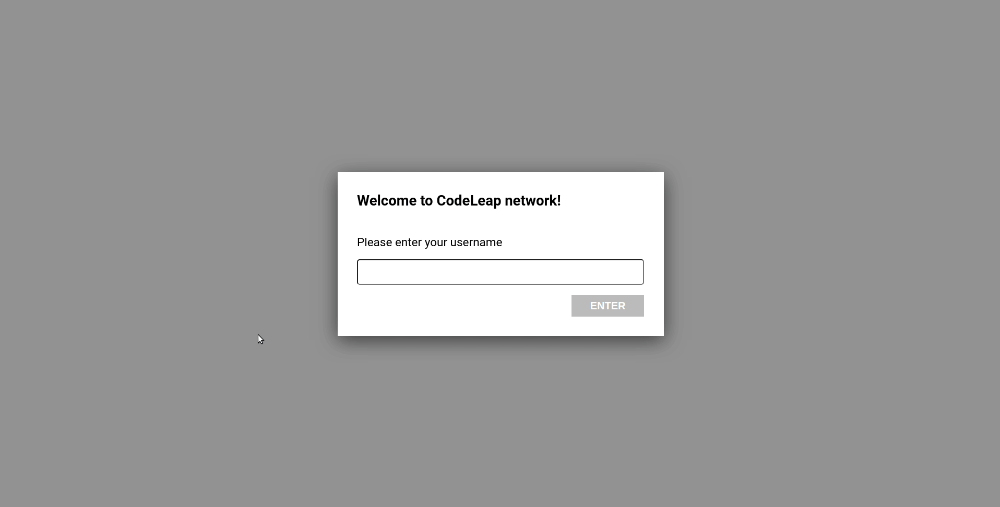
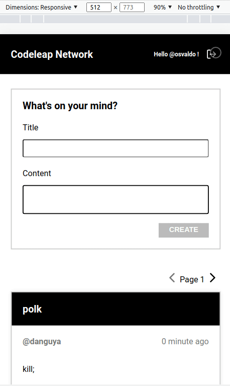

# Books

Este projeto lista posts, e permite a exclusão e edição de posts (do usuário logado)

## Screenshots

### Browser Perspectiva:


### Mobile Perspectiva:


## Bibliotecas utilizadas

- styled-components - Estilização (CSS)
- axios - Manipulação de dados das APIs
- react-icons - Para ícones
- react-router-dom - Rotas e navegação entre páginas
- eslint / prettier - Linter e formatação de código
- react-hot-toast - Feedback de usuário

# Instalando e rodando o projeto

```
 npm i
```

```
 npm start
```
## Construído com

- [ReactJS](https://pt-br.reactjs.org/) - Biblioteca Front-end.
- [Codeleap posts API](http://dev.codeleap.co.uk/careers/) - API para consumo dos dados.

## Autor

- **Osvaldo Costa** - [rimancete](https://github.com/rimancete)

## Melhorias propostas

Técnica
- Implementação de react-query
- Aplicação de UI(ex: Chakra, Material-UI ou similares) no lugar de styled-components

Layout
- Header acompanhando o scroll

Funcionalidade
- Após feedback, inabilitar campos e botões
- Filtros: Listar somente os posts do usuário ou todos

Bug
- Em alguns momentos após fechar o modal e tentar acioná-lo por alguma opção, ele não reabre. Necessitando atualizar a página para que volte ao normal
